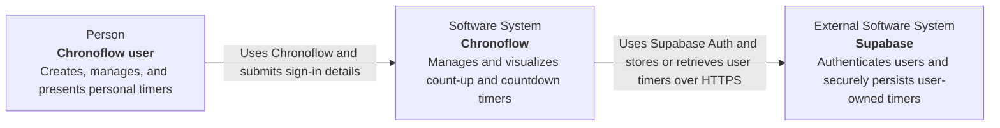
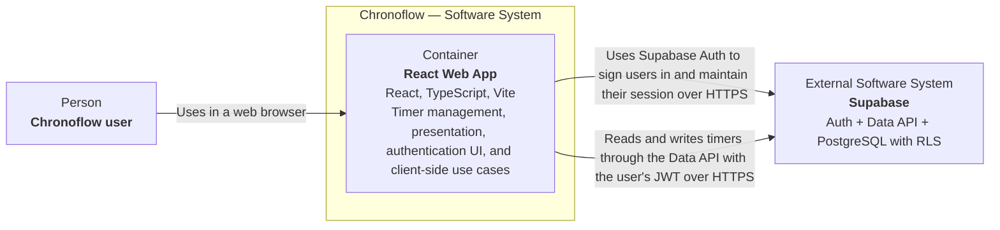

# Chronoflow — Week 1 TO-BE C4 Architecture Baseline

## Status and scope

This document describes the approved Week 1 target architecture. It is a
TO-BE baseline, not a claim about current runtime behavior.

The baseline contains only:

- a C4 System Context diagram;
- a C4 Container diagram.

Chronoflow owns one container: the React Web App. Supabase is an external
software system that provides authentication and secure timer persistence.
There is no custom Chronoflow backend in this baseline.

## Level 1 — System Context

### Context elements

| Element | C4 type | Responsibility |
| --- | --- | --- |
| Chronoflow user | Person | Signs in and creates, views, restarts, or deletes their own timers. |
| Chronoflow | Software System | Provides timer management and presentation capabilities. |
| Supabase | External Software System | Provides Auth, the Data API, PostgreSQL persistence, and RLS enforcement for user-owned timers. |

## Level 2 — Container

### Container responsibilities

| Container/system | Ownership | Responsibilities |
| --- | --- | --- |
| React Web App | Chronoflow | Renders the Manage and Presentation views, collects authentication and timer input, runs timer use cases, and accesses persistence through the existing `TimerRepository` boundary. The TO-BE persistence adapter is `SupabaseTimerRepository`. |
| Supabase | External | Authenticates users, issues the session used by the web client, exposes the timer Data API, persists timer rows in PostgreSQL, and enforces per-user access through RLS. |

The repository boundary remains inside the React Web App:
`TimerRepository` isolates the UI and use cases from the persistence adapter.
Moving from `LocalStorageTimerRepository` to `SupabaseTimerRepository` must not
require the primary React components to be rewritten.

## Trust boundary and security constraints

- The browser is a public, untrusted client. It may contain only the Supabase
  project URL and a publishable key (or legacy `anon` key), never a secret or
  service-role key.
- After sign-in, the React Web App sends the user's Supabase session JWT with
  Data API requests.
- PostgreSQL RLS is the authorization boundary. Timer access is scoped to the
  authenticated owner and is not trusted to client-side filtering alone.
- Supabase Auth identity and the timer row's `user_id` establish ownership.
- Browser-to-Supabase authentication and data traffic uses HTTPS.

These constraints align with the existing `public.timers` ownership model and
verified RLS policies. No custom backend is required for the approved Week 1
authentication and user-owned timer persistence flow.

## Current state versus target state

At the time of this baseline:

- the React runtime still uses `LocalStorageTimerRepository`;
- the Supabase timer schema and RLS policies exist and have been verified;
- Auth UI, `SupabaseTimerRepository`, and replacement of local storage are not
  yet implemented.

This documentation does not change runtime behavior or declare those remaining
integration steps complete.

## Deliberately excluded

- custom Chronoflow backend or API server;
- Supabase Edge Functions;
- component-level and code-level C4 diagrams;
- deployment topology;
- AI, notifications, and unrelated future systems.
